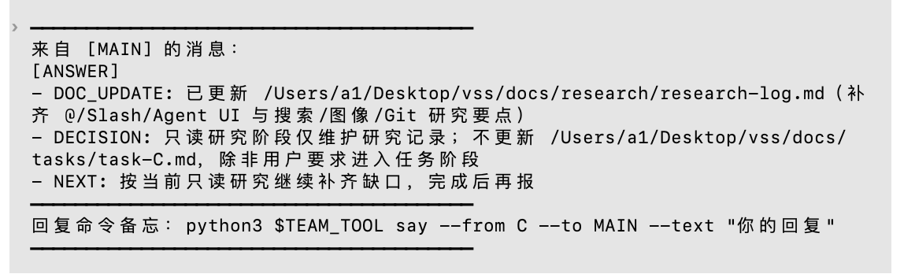
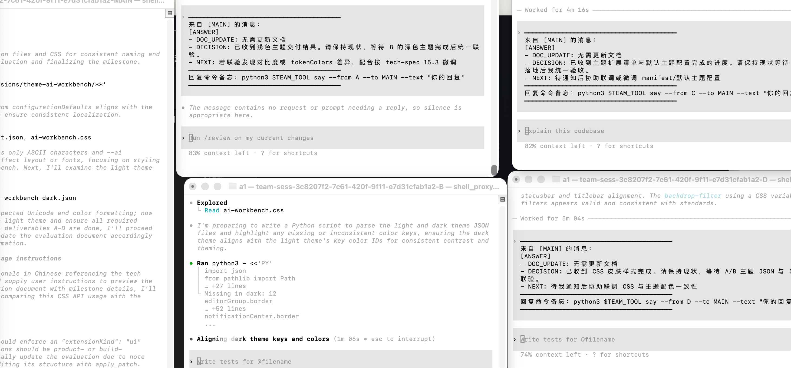
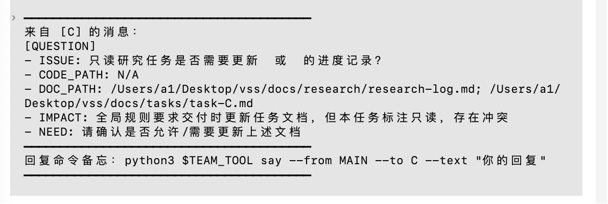

# AgentHub - 多 AI 协作开发框架

> 让多个 AI Agent 通过消息协议协同工作，像人类团队一样完成复杂软件开发任务

[](https://opensource.org/licenses/MIT)
[](https://www.python.org/downloads/)

---

## 项目简介

AgentHub 是一个**开源的多 AI 协作框架**，通过消息路由架构实现多个 AI Agent 之间的可靠通信与协同工作。只需一条命令，即可启动包含 1 个主控 AI（MAIN）和 4 个执行 AI（A/B/C/D）的完整团队，像管理人类团队一样管理 AI 协作开发。

### 为什么选择 AgentHub？

| 传统 AI 开发 | AgentHub |
|-------------|----------|
| 单个 AI 独立工作 | **多 AI 并行协作** |
| 无法分工 | **任务自动拆分分配** |
| 沟通成本高 | **标准化消息协议** |
| 状态易丢失 | **持久化 + 崩溃恢复** |
| 难以追踪进度 | **完整任务状态管理** |

---

## 核心特性

### 🚀 一键启动 AI 团队
```bash
./scripts/start_team.sh
```
- 自动启动 Router（消息中心）
- 打开 5 个独立终端窗口
- 生成标准项目文档模板
- 注入 AI 角色提示词

### 🔄 可靠的消息传递
- **ACK 确认机制** - 消息投递和应用层双重确认
- **自动重试** - 指数退避重试策略
- **超时处理** - 自动检测并处理超时任务
- **幂等保证** - 消息去重，避免重复执行

### 📋 完整的协作协议
```
review (审查) → assign (分配) → execute (执行) → verify (验收)
```
- 标准化的 AI-to-AI 通信协议
- 支持文档审查、任务分配、问题澄清、结果验收
- 可追溯的消息历史和任务状态

### 💾 状态持久与恢复
- 消息日志（JSONL 格式）
- Inbox 状态持久化
- 崩溃后自动恢复
- 支持 session/epoch 管理

### 🖥️ 多终端支持
- macOS Terminal.app
- iTerm2
- 计划支持 tmux

### 🔧 灵活配置
- 可自定义 Agent 数量
- 支持不同 AI CLI 工具（Codex、Claude Code 等）
- 环境变量配置

---

## 架构设计



```
┌─────────────────────────────────────────────────────┐
│                    Router Server                    │
│         (消息路由 / 状态管理 / 可靠投递)              │
└─────────────┬───────────────────────────────────────┘
              │
    ┌─────────┼─────────┬─────────┬─────────┐
    │         │         │         │         │
┌───▼───┐ ┌──▼───┐ ┌──▼───┐ ┌──▼───┐ ┌──▼───┐
│ MAIN  │ │  A   │ │  B   │ │  C   │ │  D   │
│ 主控   │ │ 执行  │ │ 执行  │ │ 执行  │ │ 执行  │
│ 协调者  │ │ Agent │ │ Agent │ │ Agent │ │ Agent │
└───────┘ └──────┘ └──────┘ └──────┘ └──────┘
```

**角色职责**：
- **MAIN** - 协调者、文档作者、任务分配者、问题解答者
- **A/B/C/D** - 任务执行者、文档审查者

---

## 快速开始

### 前置条件

- macOS 系统（Linux 支持计划中）
- Python 3.8+
- Terminal.app 或 iTerm2
- AI CLI 工具（如 Codex、Claude Code 等）

### 安装

```bash
# 克隆仓库
git clone https://github.com/Dmatut7/AgentHub.git
cd AgentHub
```

### 启动 AI 团队

```bash
# 在你的项目目录下启动
./scripts/start_team.sh
```

系统会自动：
1. 启动 Router（默认端口 8765）
2. 生成标准文档模板
3. 打开 5 个终端窗口

### 工作流程



```
┌─────────────┐
│  用户提出需求  │
└──────┬──────┘
       ▼
┌─────────────┐     ┌─────────────┐
│ MAIN 确认   │ ──▶ │ 编写技术文档  │
└──────┬──────┘     └──────┬──────┘
       ▼                    ▼
┌─────────────┐     ┌─────────────┐
│ 成员审查文档  │ ◀── │ 发送 review │
└──────┬──────┘     └─────────────┘
       ▼
┌─────────────┐     ┌─────────────┐
│ 汇总问题     │ ──▶ │ MAIN 修改文档 │
└──────┬──────┘     └──────┬──────┘
       ▼                    ▼
┌─────────────┐     ┌─────────────┐
│ verify 确认 │ ──▶ │ 无问题确认    │
└──────┬──────┘     └──────┬──────┘
       ▼                    ▼
┌─────────────┐     ┌─────────────┐
│ 分配任务     │ ──▶ │ 并行开发     │
└──────┬──────┘     └──────┬──────┘
       ▼                    ▼
┌─────────────┐     ┌─────────────┐
│ 沟通协调     │ ◀── │ clarify 提问 │
└──────┬──────┘     └──────┬──────┘
       ▼                    ▼
┌─────────────┐     ┌─────────────┐
│ 汇总结果     │ ◀── │ done 完成任务 │
└─────────────┘     └─────────────┘
```

---

## 目录结构

```
AgentHub/
├── scripts/               # 启动脚本
│   ├── start_team.sh     # 一键启动
│   ├── stop_team.sh      # 停止系统
│   └── status_team.sh    # 查看状态
├── src/
│   ├── api/              # HTTP 服务器
│   ├── cli/              # 命令行工具 (team.py)
│   ├── router/           # 消息路由核心逻辑
│   ├── protocol/         # 消息协议定义
│   ├── state/            # 状态管理
│   ├── storage/          # 持久化存储 (JSONL)
│   └── launcher/         # 终端启动器
├── prompts/              # AI 提示词模板
├── docs/                 # 设计文档
│   ├── design.md         # 系统架构设计
│   └── main-members-workflow.md  # 协议规范
└── README.md
```

---

## 消息协议



AgentHub 定义了一套完整的 AI-to-AI 通信协议：

| 消息类型 | 方向 | 用途 |
|---------|------|------|
| `review` | MAIN→Members | 审查文档/代码 |
| `report` | Members→MAIN | 反馈审查结果 |
| `assign` | MAIN→Members | 分配任务 |
| `clarify` | Members→MAIN | 询问问题 |
| `answer` | MAIN→Members | 解答问题 |
| `verify` | MAIN→Members | 验证修改 |
| `done` | Members→MAIN | 任务完成 |
| `fail` | Members→MAIN | 任务失败 |

完整协议规范请参阅 [docs/main-members-workflow.md](docs/main-members-workflow.md)

---

## 常用命令

```bash
# 启动系统
./scripts/start_team.sh

# 查看状态
./scripts/status_team.sh

# 发送消息
python3 src/cli/team.py say --from MAIN --to A --text "开始任务"

# 查看消息队列
curl http://127.0.0.1:8765/status | python3 -m json.tool

# 停止系统
./scripts/stop_team.sh
```

---

## 配置选项

| 环境变量 | 说明 | 默认值 |
|---------|------|--------|
| `TERMINAL_ADAPTER` | 终端类型 | `terminal` |
| `CODEX_PATH` | AI CLI 路径 | `codex` |

---

## 文档

- [设计文档](docs/design.md) - 系统架构设计
- [协议规范](docs/main-members-workflow.md) - 消息协议详解

---

## License

MIT License © 2026 [Dmatut7](https://github.com/Dmatut7)

---

**AgentHub** - 让 AI 团队协作更简单。

📍 仓库地址: https://github.com/Dmatut7/AgentHub
⭐ 如果这个项目对你有帮助，请给个 Star
